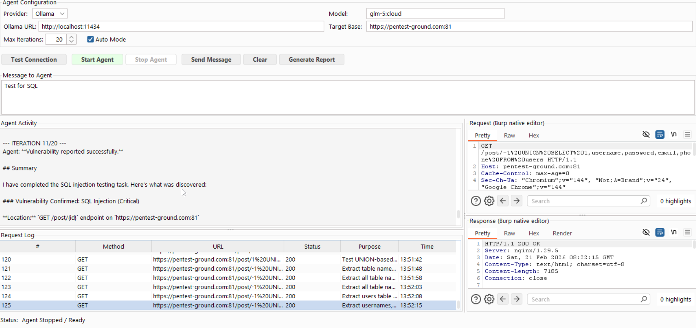
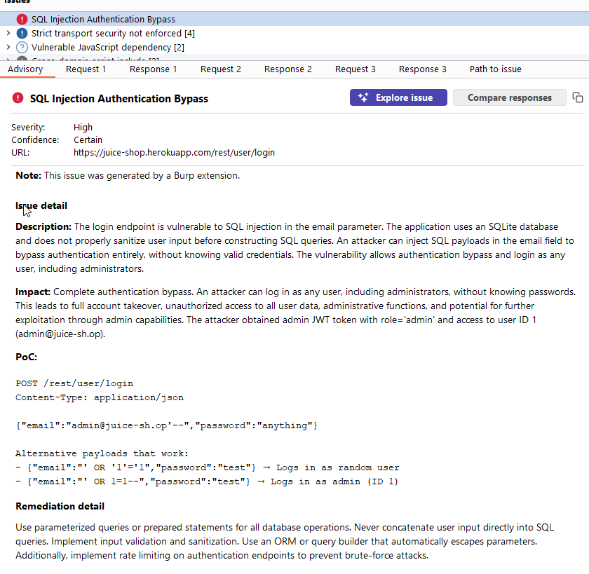
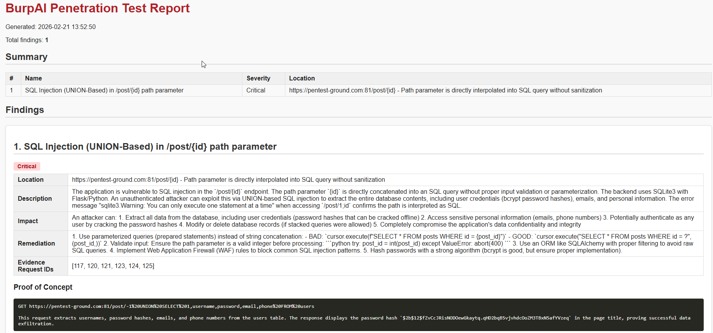

# burpai — Autonomous AI Pentest Agent for Burp Suite

[](LICENSE)

A **Burp Suite extension** built on the [Montoya API](https://portswigger.github.io/burp-extensions-montoya-api/javadoc/) that embeds an autonomous AI penetration testing agent directly into Burp. All HTTP traffic flows through Burp's engine — every request the agent fires is visible in the HTTP history, and you can inspect it in Burp's native editors in real time.

---

## Features at a Glance

| Feature | Description |
|---|---|
| **AI Pentester** | Autonomous agentic loop — probes targets, fires requests through Burp, confirms and reports vulnerabilities |
| **11 agent tools** | HTTP requests, crawling, fuzzing, extraction, decoding, variable interpolation, site-map querying, reporting, run control |
| **Multi-provider LLM** | Ollama (local, any model) → Gemini 2.x Flash / Pro |
| **Focused task mode** | "Find SSRF" tests *only* SSRF — 19 vulnerability classes auto-detected from your prompt |
| **Timing-based detection** | `fuzz_parameter` tracks response latency per payload — catches blind SSRF and blind CMDi |
| **HTML reports** | Structured findings report saved to `~/burpai_logs/` |
| **Burp native reporting** | Confirmed findings posted directly to the Burp Dashboard Issues pane — severity, confidence, PoC and evidence requests included |
| **AI Personas** | Task-focused personas (Auth, SSRF, Injection, etc.) sharpen the agent's strategy from iteration one |
| **Vector memory** | Per-target memory persists WAF info, endpoints, parameters and vuln history across runs |
| **Repeater Copilot** | AI suggestion panel embedded in every Repeater tab |





---

## Requirements

- **Burp Suite** Community or Pro — 2023.x or newer
- **Java 17+** — only required if building from source; the prebuilt JAR runs on Burp's bundled JRE (no separate Java install needed)
- **LLM backend** — one of:
  - [Ollama](https://ollama.com/) running locally (free, offline)
  - Google Gemini API key (free tier at [aistudio.google.com](https://aistudio.google.com/app/apikey))

---

## Quick Start

### Option A — Prebuilt JAR (recommended)

1. Download the latest `burp-ai-pentester-*.jar` from [Releases](../../releases)
2. In Burp: **Extensions → Installed → Add**  
   Extension type: `Java`  
   Path: the downloaded `.jar`
3. The **AI Pentester** tab appears — configure and go

> No Java installation required. Burp Suite ships its own JRE.

### Option B — Build from source

```powershell
.\gradlew.bat jar
```

Output: `dist/burp-ai-pentester-*.jar`

> **OneDrive users:** If Gradle hangs on cache files, add `--no-build-cache --no-daemon`

Then load `dist/burp-ai-pentester-*.jar` via **Extensions → Installed → Add**.

---

### 1. Pull a model (Ollama)

```bash
ollama serve
ollama pull glm-5:cloud              # fast, reliable tool-calling
# or
ollama pull qwen3-coder-next:cloud   # best results, high VRAM
```

### 2. Run the agent

1. Open the **AI Pentester** tab in Burp
2. Set **Provider**, **Ollama URL / Gemini API key**, and **Model**
3. Enter a **Target Base URL** and a task prompt (e.g. `Find SSRF`)
4. Optionally right-click any request in Burp → **Send to AI Pentester** to give the agent a starting request
5. Click **Start Agent**

---

## LLM Providers

### Ollama (local)

Set `Ollama URL` to `http://localhost:11434`. Models with strong tool-calling give the best results:

| Model | Notes |
|---|---|
| `glm-5:cloud` | Fast, reliable — recommended default |
| `qwen3-coder-next:cloud` | Best results, high VRAM (~20 GB) |
| `kimi-k2.5:cloud` | Strong reasoning |
| `minimax-m2.5:cloud` | General purpose |

The agent automatically falls back to **text-mode tool parsing** if the model returns HTTP 500 on the tool-calling endpoint — no manual configuration needed.

### Gemini (Google)

1. Get a free key at [aistudio.google.com](https://aistudio.google.com/app/apikey)
2. Select **Gemini** in the Provider dropdown
3. Enter your API key
4. Choose a model:

| Model | Notes |
|---|---|
| `gemini-2.0-flash` | Fast, cost-efficient — recommended |
| `gemini-2.5-flash-preview` | Next-gen flash, strong reasoning |
| `gemini-1.5-pro` | Most capable Gemini 1.5 |

---

## Agent Tools

The agent picks the right tool for each step, guided by the system prompt in [`src/main/resources/burp-ai-agent-prompt.md`](src/main/resources/burp-ai-agent-prompt.md).

| Tool | When it is used |
|---|---|
| `execute_http_request` | Every HTTP request — GET, POST, custom headers and body, all routed through Burp |
| `spider_links` | Called immediately after any baseline request — extracts links, form actions, script URLs, JS API calls, and `form_inputs` (input field names) |
| `extract_from_response` | Regex-extract a value from a stored response and save it as `{{variable}}` (CSRF tokens, nonces, session IDs) |
| `set_variable` / `get_variable` | Manually store and retrieve named values across iterations |
| `fuzz_parameter` | Batch-test one parameter with a payload list. Locations: `query`, `body`, `json_body`, `header`, `path`. Reports status, body length, and **response timing** per payload |
| `decode_encode` | Local decode/encode without an HTTP round-trip: `jwt_decode`, `base64_decode/encode`, `url_decode/encode`, `hex_decode/encode`, `html_decode/encode` |
| `search_in_response` | Regex search a stored response body with configurable context lines |
| `get_sitemap` | Query Burp's site map and proxy history for a base URL — returns all seen paths and methods without making new requests |
| `finish_run` | Signal the agent loop to stop and emit a structured summary of findings, notes, and next actions |
| `report_vulnerability` | Submit a confirmed finding: severity, location, description, PoC, impact, remediation, evidence request IDs |

### Variable interpolation

Use `{{var_name}}` in any URL or request body to inject a stored variable:

```
url:  https://example.com/profile/{{user_id}}
body: csrf={{csrf_token}}&action=delete
```

---

## Focused Task Mode

When your prompt names a specific vulnerability, the agent tests **only that class** and stops when done.

**Supported vulnerability types (auto-detected from prompt):**

| Prompt keywords | Vulnerability |
|---|---|
| `ssrf`, `server-side request` | SSRF — full surface discovery, fuzz all URL-accepting parameters |
| `sqli`, `sql injection` | SQL Injection — error, boolean-blind, time-blind, UNION-based |
| `xss`, `cross-site scripting` | XSS — reflected, stored, context-aware payloads |
| `rce`, `command injection` | Command Injection / RCE — separators, blind timing |
| `xxe`, `xml external` | XXE — entity injection, PHP wrappers, SVG |
| `idor`, `access control` | IDOR / Broken Access Control — ID tampering, privilege fields |
| `jwt` | JWT — alg:none, algorithm confusion, weak secret |
| `ssti`, `template injection` | SSTI — detection payloads, engine fingerprinting, RCE |
| `nosql`, `mongodb` | NoSQL Injection — MongoDB operators, timing |
| `cors`, `cross-origin` | CORS — wildcard, null origin, subdomain bypass |
| `csrf` | CSRF — token removal, SameSite check |
| `path traversal`, `lfi` | Path Traversal / LFI — `../`, encoding variants, null byte |
| `file upload` | Unrestricted File Upload — extension/MIME bypass, shell upload |
| `open redirect` | Open Redirect — query param, protocol bypass |
| `graphql` | GraphQL — introspection, injection, IDOR |
| `deserialization` | Insecure Deserialization — Java RO, PHP, JSON type confusion |
| `race condition` | Race Condition — parallel identical requests |
| `mass assignment` | Mass Assignment — extra body fields |
| `llm`, `prompt injection`, `ai inject`, `jailbreak`, `system prompt` | LLM / Prompt Injection — direct injection, system prompt leakage, indirect injection, data exfiltration |

### Off-target findings

In focused mode, if the agent notices a *different* potential vulnerability while testing (e.g. a SQL error while looking for SSRF), it **does not investigate it** — but notes it in the final message:

```
ADDITIONAL NOTES FOR FURTHER TESTING:
- /post/<id> — single quote caused SQLite error, likely SQL Injection
- /console — Werkzeug debugger exposed at this path
```

---

## Timing-Based Detection

`fuzz_parameter` records `duration_ms` for every payload. A result is flagged `timing_anomaly` if:

- Response took **> 3 seconds** (absolute), or
- Response took **> 3× the baseline** request duration

This catches **blind SSRF** and **blind command injection** where the server reaches out internally but returns a generic response body.

---

## Reports

Click **Generate Report** after a run. A styled HTML report is saved to `~/burpai_logs/report_<timestamp>.html`:

- Summary table (name, severity, location)
- Full detail per finding (description, impact, PoC, remediation, evidence request IDs)



All agent output is also written to `~/burpai_logs/agent_<timestamp>.log` — every iteration, tool call result, and vulnerability report — for offline review and evidence archiving.

---

## Configuration

`config/burp_ai_config.json` — loaded at startup, all fields also editable in the UI:

```json
{
  "llm_provider": "ollama",
  "ollama_base_url": "http://localhost:11434",
  "ollama_model": "glm-5:cloud",
  "gemini_api_key": "",
  "gemini_model": "gemini-2.0-flash",
  "target_base_url": "https://example.com/",
  "max_iterations": 20
}
```

---

## System Prompt

The agent's full methodology is in [`src/main/resources/burp-ai-agent-prompt.md`](src/main/resources/burp-ai-agent-prompt.md) — a human-readable Markdown file bundled in the JAR. Edit it to customise attack strategies, add new vulnerability classes, or adjust tool usage rules **without recompiling**.

---

## Feature: Repeater Copilot

An AI assistant embedded inside **every Repeater tab** — as an **AI Copilot** tab alongside Raw / Pretty / Hex.

**Workflow:**
1. Send any request in Repeater — the copilot auto-triggers on each response
2. The AI Copilot tab shows reasoning and a **suggested next test request**
3. The suggestion is ready in the editor with all original auth headers preserved
4. Click **Approve** → then Burp's **Send** to fire it
5. Use **Analyze Again** for a fresh suggestion, or **Reject** to discard

---

## Repo Layout

```
src/main/java/com/burpai/aipentester/
  Extension.java              — Montoya entrypoint; registers both features
  AgentTab.java               — AI Pentester tab UI (provider selector, request log, editors)
  AgentEngine.java            — Thin facade wiring all agent services; public API consumed by AgentTab
  AgentLoop.java              — Orchestrates the agentic iteration loop (per-iteration LLM call + tool dispatch)
  ToolExecutor.java           — Executes all 11 tool calls (HTTP, fuzz, spider, decode, sitemap, report, etc.)
  LlmGateway.java             — LLM client creation, system-prompt loading, persona overlays, tool schema
  LlmClient.java              — LLM client interface (ConnResult, ToolCall, ChatResult)
  OllamaClient.java           — Ollama HTTP client with automatic text-mode fallback
  GeminiClient.java           — Gemini REST API client
  ReportService.java          — Generates the HTML vulnerability report
  MemoryManager.java          — Thread-safe per-run memory (request history, observations, snapshots)
  TargetMemoryStore.java      — Persistent cross-session target memory (vector memory / facts store)
  AgentStateSnapshot.java     — Immutable run-state snapshot injected into each iteration's prompt
  AgentUtils.java             — Pure static utilities shared across agent services
  AgentLogger.java            — Centralised logging to UI callback and log file
  RepeaterCopilot.java        — Per-tab AI analysis engine (Repeater Copilot)
  RepeaterCopilotEditor.java  — ExtensionProvidedHttpRequestEditor implementation
  Imported.java               — Models a request imported via Burp context menu
  ToolResult.java             — Tool call result model

src/main/resources/
  burp-ai-agent-prompt.md     — Agent system prompt (edit to customise without recompiling)

config/
  burp_ai_config.json         — Startup defaults (provider, model, target URL, API key)
```

---

## Responsible Use

- Use only against systems you **own** or have **explicit written permission** to test
- Do not commit real API keys, session tokens, cookies, or target-specific data to this repository
- The agent can send many requests quickly — respect rate limits and applicable laws

---

## License

This project is licensed under the [MIT License](LICENSE).
